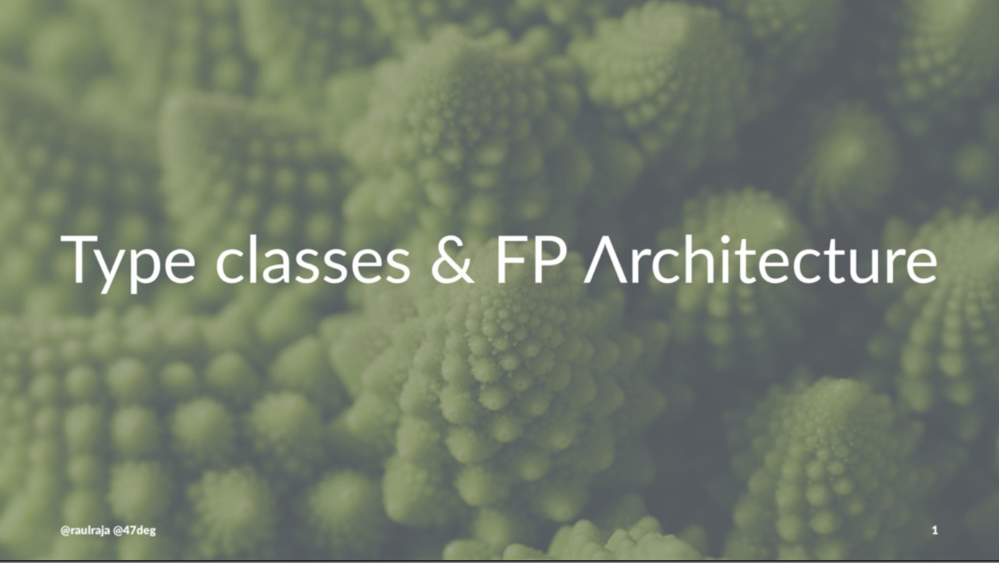

# Intro to Typeclasses in FP Architectures #
A brief introduction to the core Functional Programming traits and the power of coding to abstractions using Typeclasses.

**Download the presentation**

1. Interactive : Clone this repo and run `sbt tut console`
2. [PDF](presentation.pdf) Download
3. [MD](presentation.md)
4. [SpeakerDeck](https://speakerdeck.com/raulraja/typeclasses-in-fp-architecture)

